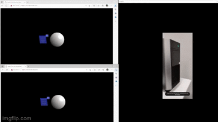
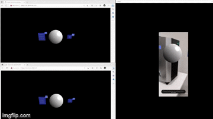

# Corquet.io-examples

This repository contains some examples of applications made using BABYLON.js and Croquet.io

In detail the examples realized have as objective to create a collaborative XR experience thanks to the use of WebXR.

## Change Color Hologram example

This example gives the possibility to the different connected users to view the same hologram and to be able to modify the color by means of a dedicated menu, realized through the support to the MRTK that BABYLON.js provides.

You can find the example in the directory `ExampleChangeColorHologram`.

## Manipulate Hologram example

This example shows how it is possible to enable the manipulation of the hologram thanks to the elements made available by BABYLON.js and how to propagate the changes to other connected users.

